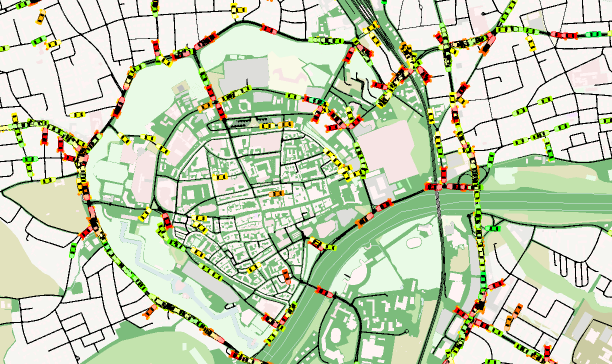

# Traffic simulation of Ingolstadt in SUMO

## Created in the SAVe:, SAVeNoW and KIVI projects

## Getting started

To run the simulation you need to download Eclipse SUMO (Simulation of Urban Mobility) from https://www.eclipse.org/sumo/ or https://github.com/eclipse/sumo. The provided simulation was developed and tested with SUMO 1.10.0.

Make sure you have git lfs (large file storage) set-up since all large .xml files are tracked using it.

After cloning, you can run the simulation by clicking the config file "simulation/24h_sim.sumocfg".

If the simulation is slow, try removing the polygons from the config file.

## Simulation setup

The 24h simulation currently contains routes for passenger vehicles, heavy-vehicle traffic as well as bicycles. Both vehicle demand as well as traffic light settings are created from data for Wednesday the 16.09.2020 to create a weekday traffic situation mostly uninfluenced by covid-restrictions. More details on the simulation setup are provided in [simulation_setup](docs/simulation_setup.md) and in the listed publications.

## Contributing

The simulation was created to provide a realistic multi-modal environment for traffic research. The model is under continuous development and issue reports and contributions are greatly appreciated. Feel free to get in touch with us by opening an issue in the repository.

## Research

When using the simulation in your research, feel free to cite this publication describing the simulation setup.
Michael Harth, Marcel Langer and Klaus Bogenberger, Automated Calibration of Traffic Demand and Traffic Lights in SUMO Using Real-World Observations, *SUMO Conference Proceedings*, 2021, DOI will follow soon

The calibration of driver-behavior based on real-world vehicle trajectories is presented in:
Marcel Langer, Michael Harth, Lena Preitschaft, Ronald Kates and Klaus Bogenberger, Calibration and Assessment of Urban Microscopic Traffic Simulation as an Environment for Testing of Automated Driving, *IEEE Intelligent Transportation Systems Conference*, 2021, DOI will follow soon

## Acknowledgements

* Thank you to Lutz Morich of Audi and Prof. Klaus Bogenberger of TUM for providing the working environment and making this work possible.
* We appreciate the funding of the SAVe: and KIVI research projects by BMVI as well as the funding for the SAVeNoW research project by BMWi.
* Initial setup by Marcel Langer and Michael Harth.
* Continuous improvements by Natalie Sautter, Martin Margreiter and Mario Ilic in the SAVeNoW and KIVI Projects.
* Special thanks to all who supported to project over the years including Philipp Neuhaus, Lena Preitschaft, Philipp Wulff, Navneet Singh Dhir, Camilo Cardona Torres and Danil Belikhov.

## Licence

The simulation is distributed by AUDI AG and the Chair of Traffic Engineering and Control of the Technical University of Munich under the Apache License Version 2.0. SUMO is available as open source under the Eclipse Public License 2.0. For more detailled information check [LICENSE](LICENSE.md). 

